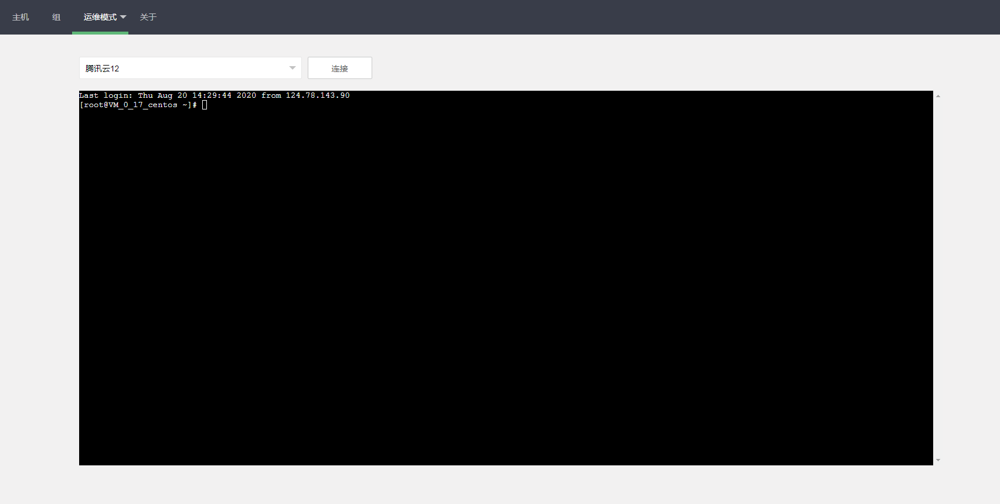
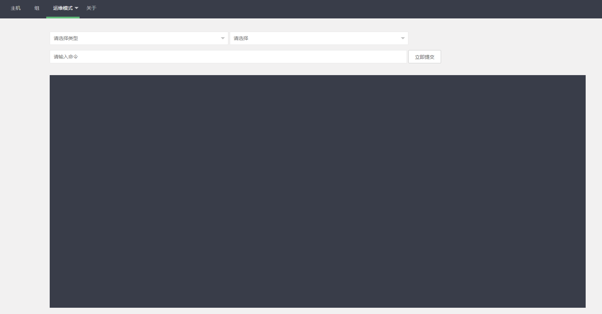
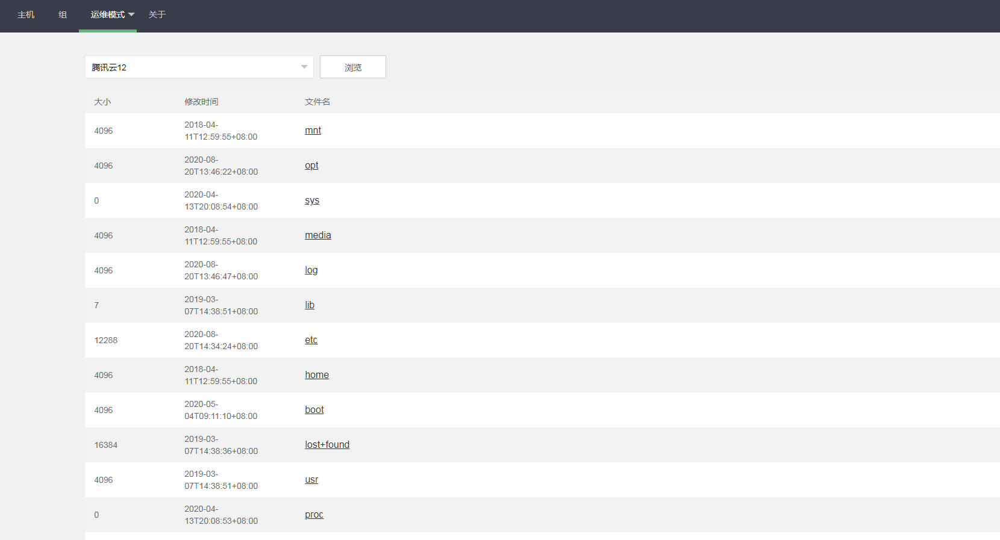

## 项目简介
本项目使用gin、gorm和ssh、sftp开发。前端使用的是layui框架。主要用来在网络条件差或者没有其他可用的ssh客户端时做批量任务执行和ssh连接。目的是做一个阉割版的xshell并简单的实现ansible或者saltstack的部分功能。

**API文档**

[markdown](./doc/lv1/API.md)

[swagger](./doc/lv1/swaggerAPI.json)

#### 项目依赖
https://github.com/gin-gonic/gin

https://gorm.io/gorm

https://github.com/gorilla/websocket

#### 使用说明
1. 安装编译
```shell script
#安装packr工具
go get -u github.com/gobuffalo/packr/packr

# 打包
packr build
```

2. 启动 创建config.yaml在可执行文件同级 运行即可(例如conf/conf.yaml)
```shell script
# 支持mysql postgres sqlite(默认,仅调试)
app:
  name: oms
  addr: 127.0.0.1
  port: 8080
  mode: dev

db:
  driver: sqlite
  user: root
  password: 123456
  dsn: 127.0.0.1:3306
  db_name: oms
```

3. 关于配置, 默认使用内嵌在二进制文件中的`conf/config.yaml.example`, 如果当前目录存在`config.yaml`则以此文件优先。

#### 目前已经实现的功能

1. 基于websocket和xtermjs的webssh。

2. 文件的批量分发。

3. 批量执行命令。

4. 主机文件的浏览和下载，删除和上传。

5. 主机的curd管理。

6. 使用组和标签的匹配以及模仿saltstack的匹配。
```shell script
-L 列表匹配
-L 192.168.1.1,192.168.1.2
-E 正则
-E .*?
-G 通配符
-G 192.168.1.*
以上匹配都只针对主机的addr
```
7. 后台定时任务判断主机的状态。
8. 数据库内容的导入导出。

#### 目前正在开发的
0. 修复BUG。

1. 类playbook形式的批量任务集合构思开发。
2. ~~ssh、sftp转换为websocket形式。~~ 
3. 使用react或vue开发前端。
4. ~~组件service化，比如ssh/sftp的websocket。~~ 
5. 类似saltstack的agent开发。

## 感谢
https://github.com/mojocn/felix

https://github.com/pytool/ssh

https://github.com/hequan2017/go-webssh