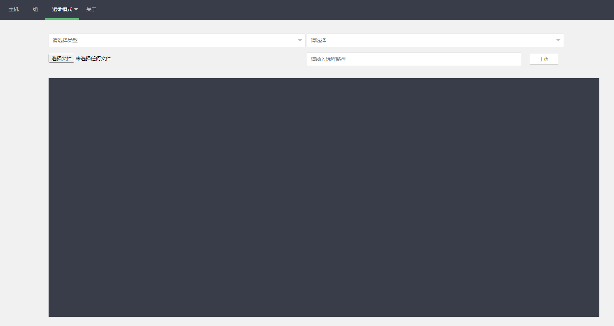

## 项目简介

​本项目使用beego和ssh、sftp开发。前端使用的是layui框架。主要用来在网络条件差或者没有其他可用的ssh客户端时做批量任务执行和ssh连接。目的是做一个阉割版的xshell并简单的实现ansible或者saltstack的部分功能。

#### 项目依赖
https://github.com/astaxie/beego

https://github.com/gorilla/websocket

#### 使用说明
1. 安装编译
```shell script
#安装bee工具
go get -u github.com/gobuffalo/packr/packr

# 打包
packr build
or
GOOS=windows GOARCH=amd64 packr build
```

2. 启动 修改app/app.conf 的以下内容 运行即可
```shell script
# 数据库配置
mysqluser = "root"
mysqlpass = "123456"
mysqlurls = "127.0.0.1:3306"
mysqldb   = "oms"
```

#### 目前已经实现的功能

1. 基于websocket和xtermjs的webssh。

2. 文件的批量分发。

3. 批量执行命令。

4. 主机文件的浏览和下载，删除和上传。

5. 主机的curd管理。

6. 使用组和标签的匹配以及模仿saltstack的匹配。
```shell script
-L 列表匹配
-L "192.168.1.1,192.168.1.2"
-E 正则
-E ".*？"
-G 通配符
-L "192.168.1.*"
以上匹配都只针对主机的addr
```
7. 后台定时任务判断主机的状态。
8. 数据库内容的导入导出

#### 目前正在开发的

1. 类playbook形式的批量任务集合构思开发。

## 感谢
https://github.com/mojocn/felix

https://github.com/pytool/ssh

https://github.com/hequan2017/go-webssh

## 最后
因为时间紧促且自己学习go时间比较短, 所以代码写的比较烂, 之后会持续开发修复BUG, 如果感兴趣的可以给个star, 也可联系我共同学习

email & qq: 918562230@qq.com